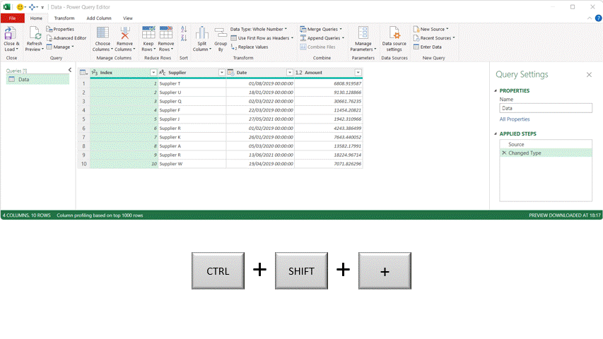

```{r setup, include=FALSE}
knitr::opts_chunk$set(echo = FALSE)
```

A tip that is often forgotten about is how to zoom in and out when using the Power Query Editor. The text showing the data table can appear small to those with visual difficulties. Even for those without difficulties, the size of the text can prove problematic at times.

To increase the size of the text shown in the editor window, use the key combinations of 

`CTRL SHIFT +` to zoom in

`CTRL SHIFT -` to zoom out 

<div style="margin-top:40px" />
<br>
<center>
{width=80%}
</center>
<br>


