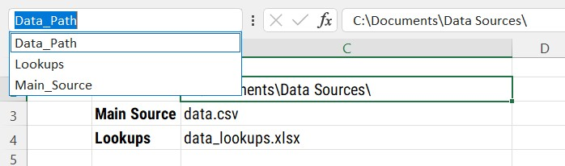
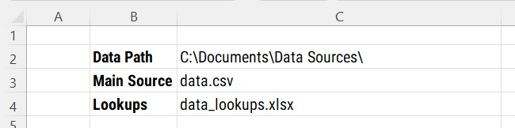
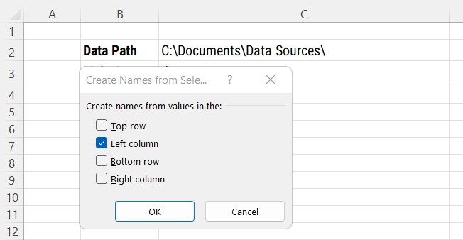
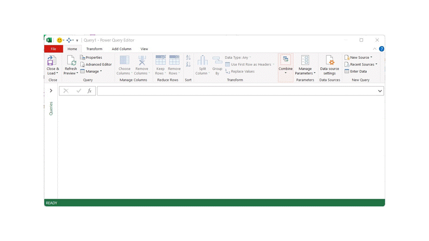
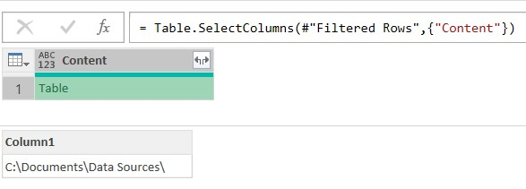
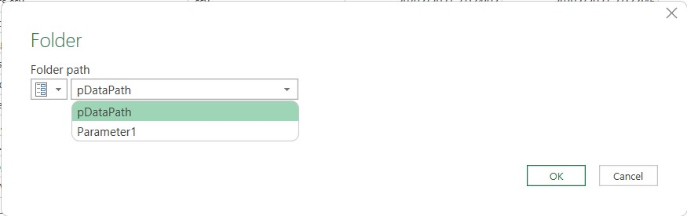

<style>
d-article li {
margin-bottom: 2px
}

d-article code {
color: #595959;
font-size: 70%
}
</style>

```{r setup, include=FALSE}
knitr::opts_chunk$set(echo = FALSE)
```

# The Problem

When I first started using Power Query, in one of its very early versions, file paths to data sources were often hard-coded into each query. This would cause issues if the workbook was sent to another user and the data source was in a folder on my file structure, obviously, the other user would not have access to my folders!

The method of using filenames then changed to using a table on a worksheet, often named `Parameters` that would list all the file paths for all data sources used by Power Query. This method worked fine until one monster of a workbook was developed. With 17 or so data sources from a variety of locations, both shared network folders and SharePoint Document Libraries, the process began to get slower and slower. 

To extract a file path and name from the `Parameters` worksheet would take an age to load in the Power Query Editor window just to make a change to the query or to refresh it when in the editor window. 

A new method was needed.

# The Solution

I had used the `New Parameter` method from the Power Query Editor window to add a value to an item, but others using the workbook are not always confident in using the editor. The solution was to use Excel Named Ranges and call them in one line of M code.

## TL;DR

1. Create a new blank query
2. Rename the query to the required name
3. Open the Advanced Editor
4. Remove the M code shown
5. Paste in the line below, replacing the `Data_Path` value to the name of your named range

`Excel.CurrentWorkbook(){[Name="Data_Path"]}[Content]{0}[Column1] meta [IsParameterQuery=true, Type="Text", IsParameterQueryRequired=false]`

6. Click OK

## Creating a Named Range

A named range in Excel can be a single cell or any number of cells that have a name assigned to them. Named ranges can be accessed from the drop down box to the left of the formula bar.



For this example, I have created three named ranges, one for each file and the data path those files are saved in.



Each cell has been named based on the value in column B of the worksheet. Spaces have been replaced with underscores where they exist.

To create a named range quickly, hit the `CTRL + SHIFT + F3` keys and a dialog box will be shown asking where the name for the range is. In the example shown, both cells B2 and C2 have been selected, with cell B2 containing the name to assign to cell C3



If all looks OK in the `Create Names from Selection` dialog box, click OK. Selecting cell C3 will shown `Data_Path` in the Named Range drop down list as shown in the first image above.

## Extracting the Named Range value

Although I mentioned above that the parameter can be created in one line of M code, we'll look at the process of extracting named ranges from a worksheet.



The steps in the image above, produce these lines of M code. 

```
let
    Source = Excel.CurrentWorkbook(),
    #"Filtered Rows" = Table.SelectRows(Source, each ([Name] = "Data_Path")),
    #"Removed Other Columns" = Table.SelectColumns(#"Filtered Rows",{"Content"}),
    #"Expanded Content" = Table.ExpandTableColumn(#"Removed Other Columns", "Content", {"Column1"}, {"Column1"}),
    Column1 = #"Expanded Content"{0}[Column1]
in
    Column1
```

### What does this code do?

This will list all the named ranges, sheets names and tables.

```
Source = Excel.CurrentWorkbook()
```
This step will filter the list of named ranges to the required value. 

```
#"Filtered Rows" = Table.SelectRows(Source, each ([Name] = "Data_Path")),
```

Removing the Name column from the table shown in the editor window, by selecting just the `Content` column.

```
#"Removed Other Columns" = Table.SelectColumns(#"Filtered Rows",{"Content"})
```

This step expands the content in the row for the content column. Clicking in a white space area, next to the word `Table` will give a preview of the value(s) stored in that table.

```
#"Expanded Content" = Table.ExpandTableColumn(#"Removed Other Columns", "Content", {"Column1"}, {"Column1"})
```




```
Column1 = #"Expanded Content"{0}[Column1]
```
By right-clicking in a white space area next to the word `Table` and select `Drill Down` to get to the value of the named range.

A lot of steps to get to one value.

## Create the Power Query Parameter

The important parts of the M code above, that are needed to use as a one line query are:

```
Excel.CurrentWorkbook()

[Name] = "Data_Path"

"Content"

{0}[Column1]

```

These values can be combined into one line:

`Excel.CurrentWorkbook(){[Name="Data_Path"]}[Content]{0}[Column1]`

The only part now needed is some meta data that lets Power Query know that this query is actually a parameter.

` meta [IsParameterQuery=true, Type="Text", IsParameterQueryRequired=false]`

Combining these two sets of M code to create the final result.

`Excel.CurrentWorkbook(){[Name="Data_Path"]}[Content]{0}[Column1] meta [IsParameterQuery=true, Type="Text", IsParameterQueryRequired=false]`

## Using the Parameter

To use the parameter in a query, just replace any previously hard-coded path or file name. As the query contains the meta data values at the end, the value will also be available in any drop-down lists for parameters.



# Conclusion

This method of using named ranges from worksheets has reduced development time when creating automated excel workbooks. 

There is also a method for storing many parameters in one query, but that can be a post for another day.

<div style="margin-bottom:100px" />