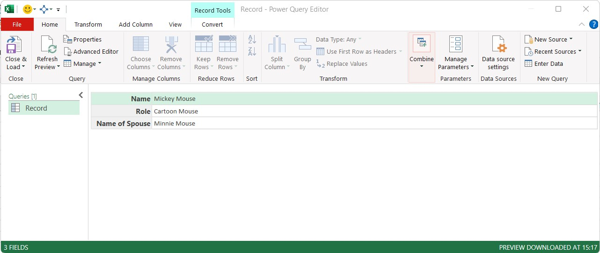
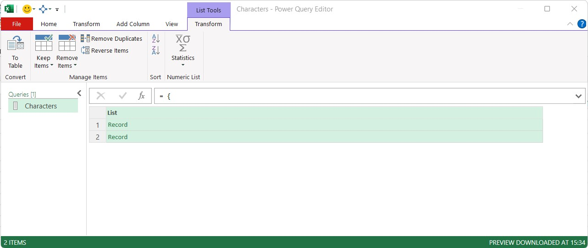
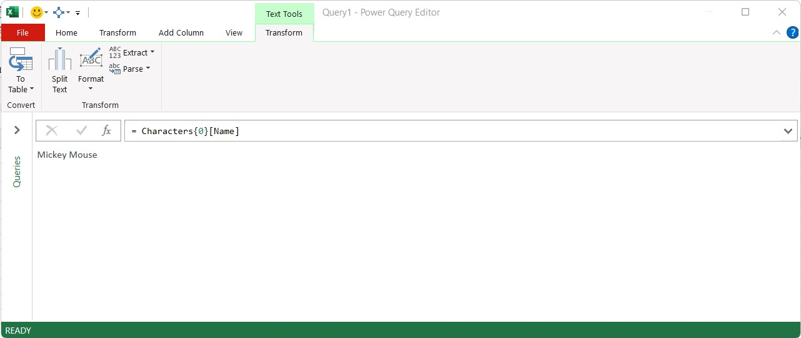

```{r setup, include=FALSE}
knitr::opts_chunk$set(echo = FALSE)
```

```{=html}
<style>
d-article li {
margin-bottom: 2px
}

d-article code {
color: #595959;
font-size: 70%
}

</style>
```
# The Problem

In the [last post](https://gfc-learning.netlify.app/posts/2022-08-15-how-to-parameterise/) we learnt how to create Power Query parameters from named ranges on a worksheet using just one line of M Code. This method is great if the set of queries only have a few parameters that would be references, but what if there were many parameters? There is the possibility that with a large number of parameters, keep track of them all in the Power Query Editor could cause issues. What if we could store them all in one query?

# The Solution

## Using Records

A record can be thought of as a single vertical column of data. Think of it as one row from a table of data, but shown vertically. Records in Power Query can be in tables, lists and can also be created manually if needed.

The structure of a record requires a name for a field within the record and a value to store within that field. All fields that are within a record must be wrapped in square brackets.

    [
        Name = "Mickey Mouse",
        Role = "Cartoon Mouse",
        Name of Spouse = "Minnie Mouse"
    ]



> Note - A field within a record can contain multiple spaces without the need to wrap the name within a \#"" in a normal power query. Values assigned to fields must have the value enclosed in quotes if spaces are in the value.

## Using a value from a record field

To refer to a field within a record, the name of the query and the field name can be used using the syntax of `QueryName[FieldName]`

For the example above, if the query name was `Mickey`, to extract each of the values, the M code would be

    Mickey[Name]

    Mickey[Role]

    Mickey[Name of Spouse]


## Multiple Records

To create multiple records within one query, wrap the records within curly brackets. Using curly brackets converts this query to a list. 

> Note: Each record must contain the same field names, although a field can contain a null value.


    {
        [
            Name = "Mickey Mouse",
            Role = "Cartoon Mouse",
            Name of Spouse = "Minnie Mouse"
        ],
        [
            Name = "Donald Duck",
            Role = "Cartoon Duck",
            Name of Spouse = "Daisy Duck"
        ]
    }




## Using a value from a multi-record list

As Power Query uses zero-based counting, the first record in the example above, would have a zero index, the second record would have an index of 1, and so on. To extract a value from the multi-record list, use the syntax `QueryName{Index}[FieldName]`

For the example above, if the query name was `Characters`, to extract each of the values for the name fields, the M code would be

```
Characters{0}[Name]

Characters{1}[Name]

```



## Creating the parameters record

Using the methods above, we can create our record for storing the parameters by wrapping the three items in square brackets and create a multi-field single record query named `FileParameters`


```
[
    DataPath = Excel.CurrentWorkbook(){[Name="Data_Path"]}[Content]{0}[Column1] 
    meta [IsParameterQuery=true, Type="Text", IsParameterQueryRequired=false],
    
    MainSource = Excel.CurrentWorkbook(){[Name="Main_Source"]}[Content]{0}[Column1] 
    meta [IsParameterQuery=true, Type="Text", IsParameterQueryRequired=false],
    
    Lookups = Excel.CurrentWorkbook(){[Name="Lookups"]}[Content]{0}[Column1] 
    meta [IsParameterQuery=true, Type="Text", IsParameterQueryRequired=false]
]

```

> Note: There is no need for an = sign at the start of a query containing a record.

To use the parameters above in a query to load data, we call the `FileParameters` query and use the relevant fields to extract the required data.

```
let
    Source = Csv.Document(
        File.Contents(
            FileParameters[DataPath] & FileParameters[MainSource]
            ),
        [Delimiter=",", Columns=4, Encoding=1252, QuoteStyle=QuoteStyle.None]
    )
in
    Source

```

# Conclusion

Using a parameters query to store values from named ranges on a worksheet may take a little effort to initially set-up, but I believe that outweighs the need to remember how to refer to or look up the syntax to extract a named range each time one is needed to be used.

I have also seen vast improvements in the speed of loading data from workbooks, either saved locally or on SharePoint sites, from several minutes to just a few seconds.


<div style="margin-bottom:100px" />
