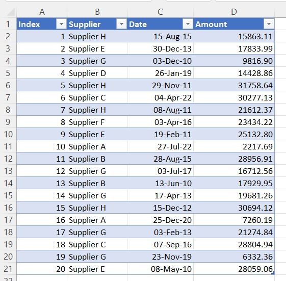
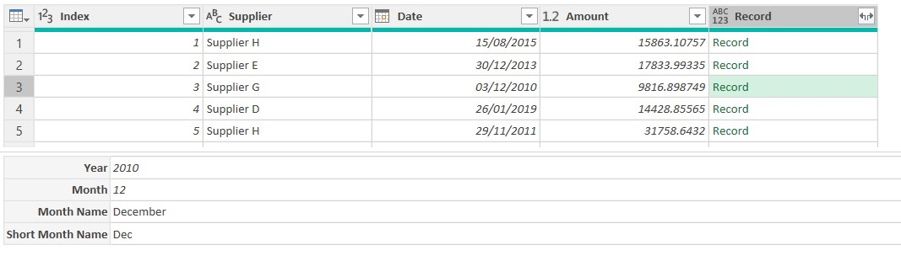
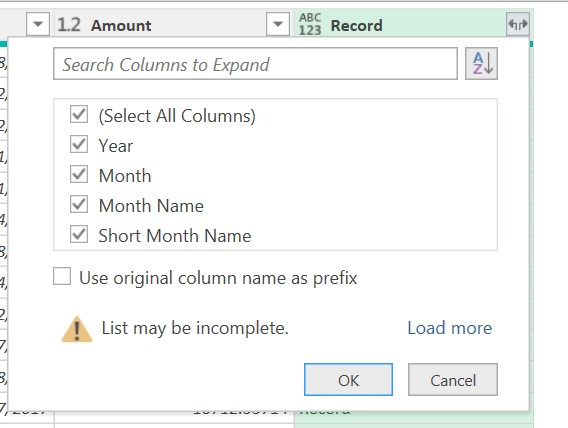
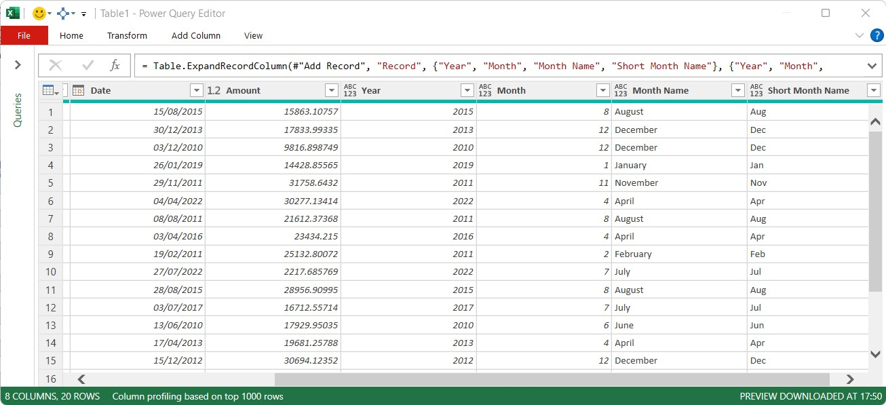
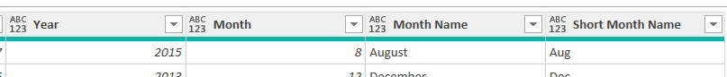
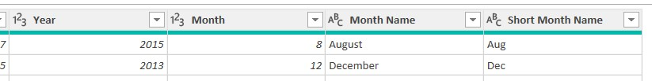

```{r setup, include=FALSE}
knitr::opts_chunk$set(echo = FALSE)
```

```{=html}
<style>
d-article li {
margin-bottom: 2px
}

d-article code {
color: #595959;
font-size: 70%
}

</style>
```
# The Problem

There may be occasions when many columns are required to be added to a Power Query table. These new columns may be because of certain business rules, extracting information from an existing column or performing date and time calculations.

# The Solution

In the [post describing records](https://gfc-learning.netlify.app/posts/2022-08-15-how-to-parameterise/) we learnt that a power query can contain a record, or even a list of records, that contain multiple fields.

Records for each row in a table can be added via the normal `Table.AddColumn` function in Power Query. Many fields can be added to the record, with the required calculations, and then the record can be expanded to convert those record fields into new columns within the table.

## The Source Data

In this example, we will be using a simple data set, stored in a table named `Table1` on a worksheet within a workbook.



The table is loaded in the usual manner into Power Query, via the `From Table/Range` button on the `Data` tab on the Excel Ribbon.

```
let
    Source = Excel.CurrentWorkbook(){[Name="Table1"]}[Content],
    #"Changed Type" = Table.TransformColumnTypes(Source,
        {
            {"Index", Int64.Type}, {"Supplier", type text}, 
            {"Date", type date}, {"Amount", type number}
        }
    )
in
    #"Changed Type"
```

> Note: This method does require manual typing of M Code in the Advanced Editor

### Adding Records

To add multiple columns, in this instance, we will add record fields for the year, month and month name from the `Date` column in the source table. As mentioned in the [post describing records](https://gfc-learning.netlify.app/posts/2022-08-15-how-to-parameterise/), records can be added by enclosing then in square brackets.

Open the Advanced Editor and add in the lines of M Code to create a new column containing a record for each row

```
[
Name of Field = field value
]

```

Using the `Table.AddColumn` function, we add the record for each row.

```
let
    Source = Excel.CurrentWorkbook(){[Name="Table1"]}[Content],
    #"Changed Type" = Table.TransformColumnTypes(Source,
        {
            {"Index", Int64.Type}, {"Supplier", type text}, 
            {"Date", type date}, {"Amount", type number}
        }
    ),
    #"Add Record" = Table.AddColumn(#"Changed Type",
        "Record",
        each
            [
                Year = Date.Year([Date]),
                Month = Date.Month([Date]),
                Month Name = Date.MonthName([Date]),
                Short Month Name = Text.Start(#"Month Name", 3)
            ]
    )
in
    #"Add Record"

```
As shown below, each row now has a `Record` in the new `Record` column.



Clicking in an empty area of a cell to the right of one of the `Record` items will show the field values in the record, as shown at the bottom of the image above.

### Expanding the Records

Now each row has a record, the fields need to be expanded to create new columns in table. This is achieved by clicking the double arrows at the top of the `Record` column.


Clicking this double arrow button will show a pop-up with a list of the field available



> Note: It is suggested that the checkmark is removed for the `Use original column name for prefix` checkbox at the bottom of the pop-up

Once the `OK` button on the pop-up is clicked, the new columns will be added to the table.



### Updated M Code

After the record column has been expanded, the extra M code, in the last `#"Expanded Record` step has been added to the Power Query table.

```
let
    Source = Excel.CurrentWorkbook(){[Name="Table1"]}[Content],
    #"Changed Type" = Table.TransformColumnTypes(Source,
        {
            {"Index", Int64.Type}, {"Supplier", type text}, 
            {"Date", type date}, {"Amount", type number}
        }
    ),
    #"Add Record" = Table.AddColumn(#"Changed Type",
        "Record",
        each
            [
                Year = Date.Year([Date]),
                Month = Date.Month([Date]),
                Month Name = Date.MonthName([Date]),
                Short Month Name = Text.Start(#"Month Name", 3)
            ]
    ),
    #"Expanded Record" = Table.ExpandRecordColumn(#"Add Record", 
        "Record", 
        {"Year", "Month", "Month Name", "Short Month Name"}, 
        {"Year", "Month", "Month Name", "Short Month Name"}
    )
in
    #"Expanded Record"

```

> Note: The second list of field names in the `#"Expanded Record` step is not actually required. The step will work fine without this. The second list is used if a new name is needed for the expanded record field.

## The Problem with Records

Looking at the column headers for the new columns, the icon shown is for the `any` data type icon of 123ABC. We would then need to set the correct data type for each of these new columns manually.



### The Solution

To remove the need to manually set the data types for columns created from record fields, the initial M code that created the record can be amended. Adding another record within the step listing the data types solves this issue.

```
let
    Source = Excel.CurrentWorkbook(){[Name="Table1"]}[Content],
    #"Changed Type" = Table.TransformColumnTypes(Source,
        {
            {"Index", Int64.Type}, {"Supplier", type text}, 
            {"Date", type date}, {"Amount", type number}
        }
    ),
    #"Add Record" = Table.AddColumn(#"Changed Type",
        // Set the name of the new column
        "Record",
        
        // Add fields to the recoed by wrapping in square brackets
        each
            [
                Year = Date.Year([Date]),
                Month = Date.Month([Date]),
                Month Name = Date.MonthName([Date]),
                
                // Note that the Month Name field must be enclosed in a # and "" as the field is
                // referenced in a standard function.
                Short Month Name = Text.Start(#"Month Name", 3)
            ],
            
            // Add a type record to assign data types to each field in the record
            type
            [
                Year = Int64.Type,
                Month = Int64.Type,
                Month Name = text,
                Short Month Name = text
            ]
    ),
    #"Expanded Record" = Table.ExpandRecordColumn(#"Add Record", 
        // Name of the column to expand
        "Record", 
        
        // The fields to expand
        {"Year", "Month", "Month Name", "Short Month Name"}
    )
in
    #"Expanded Record"

```

> Note: The #"Expanded Record" step has had the second list of field names removed.

Once this new record listing the field data types have been added, the column data types now have the correct type assigned.



# Conclusion

This method of adding multiple columns is quick, and once the structure is understood, a standard method for adding new columns, reducing the number of steps in a Power Query.

