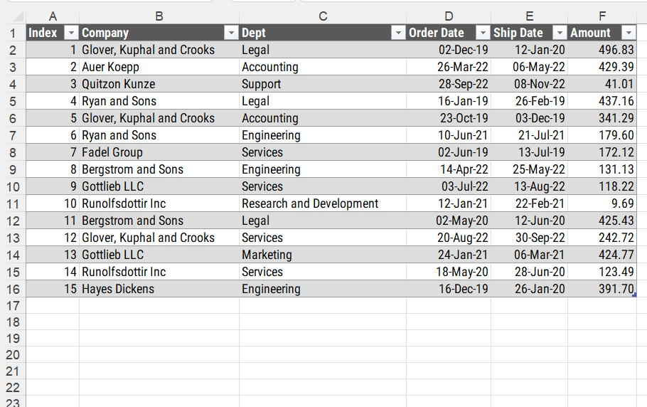
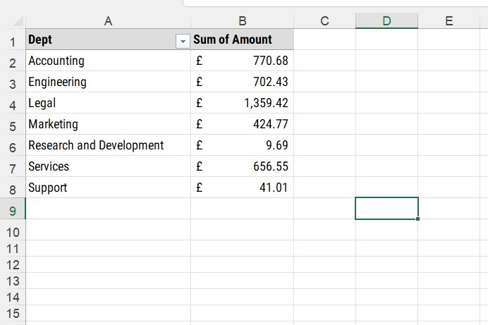
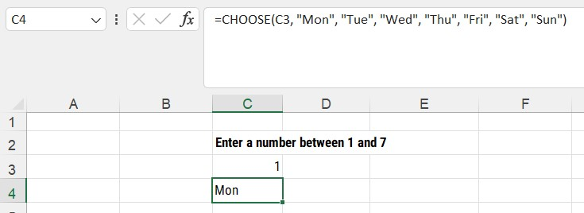
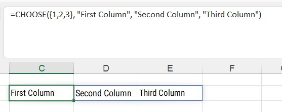
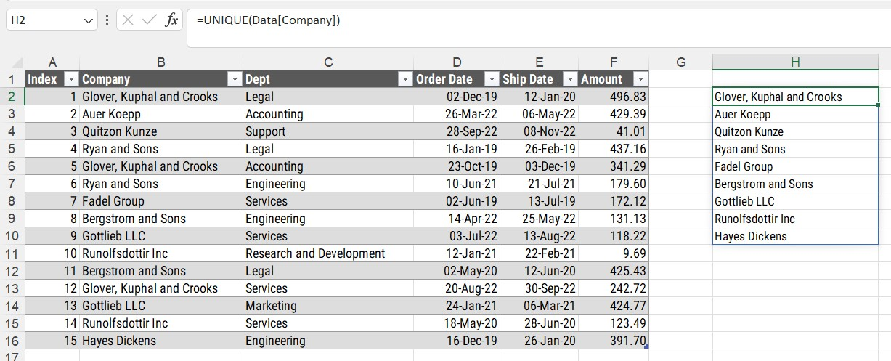
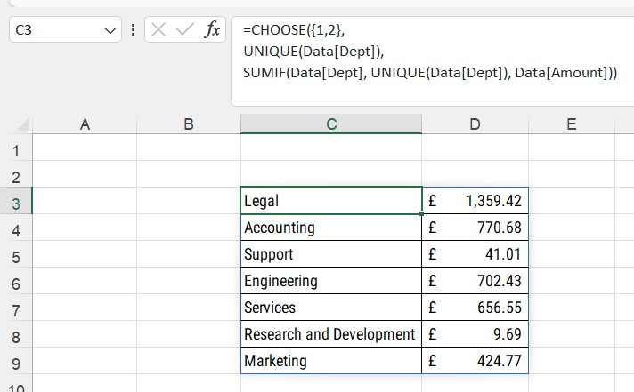
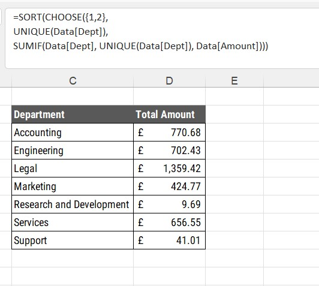

```{r setup, include=FALSE}
knitr::opts_chunk$set(echo = FALSE)
```

```{=html}
<style>
d-article li {
margin-bottom: 2px
}

d-article code {
color: #595959;
font-size: 70%
}

</style>
```

# The Problem

I have worked with many project managers over the last 25 years. Many of them were very good at using MS Excel, some though were not. Two project managers spring to mind though. One was terrified of pivot tables. They insisted on not using them and would create workbooks with a sea of COUNTIFS and SUMIFS formulas. The other project manager loved pivot tables. Could not get enough of them. They would create pivot tables with practically every column available in a dataset, creating pivot tables that, if printed, could waste several trees of paper they were so large.

# The Solution

With the recent addition of spilled arrays in MS Excel, creating summaries of data can be completed using just one formula. The advantage of using spilled arrays for summaries of data is that they updated automatically when new data is added to the source data unlike pivot tables, or summaries calculated through Power Query, that need to be refreshed via the Ribbon.

## The Source Data

The source data we will be using for this example is shown below. A simple table of just 15 rows of data showing orders made by certain departments in a company, the name of the supplier, the order and ship date along with the amount of the order.



The data is saved in an MS Excel table with the name of `Data` on its own worksheet. We shall be adding a summary of the data by department showing how much each one spent on orders. Over the next several posts we shall expand on what the summary shows and the possible solutions.

## Summary using a normal pivot table

Using a normal pivot table for the source data, we are shown the summary below. We shall be recreating this summary using one formula.



## Using CHOOSE and UNIQUE

A simple one cell summary formula can be created using the `CHOOSE` and `UNIQUE` formulas. But first lets look at the `CHOOSE` function in a little more details.

### CHOOSE

The MS Excel help for `CHOOSE` states: 

> Uses index_num to return a value from the list of value arguments. Use CHOOSE to select one of up to 254 values based on the index number. For example, if value1 through value7 are the days of the week, CHOOSE returns one of the days when a number between 1 and 7 is used as index_num.


Using the above description, we can create a formula that will identify the day of the week based on an input number.





The `CHOOSE` function can also spilled values across columns. By using curly braces with a list of numbers in the first argument of the `CHOOSE` formula, we can add values across multiple columns in a row.



As shown in the image above, the three cells containing values in columns C, D and E have a blue border around. This indicates a spilled array.

### UNIQUE

One of the more powerful formulas to be added to MS Excel in recent years is the `UNIQUE` formula. As the name suggests, the formula will extract a list of unique values from a range of cells. 



## Putting it all together

Looking at the standard pivot table solution shown above, we need to decide what we need to include in our summary of data.

- A list of unique department names from our source data table
- A SUMIF formula to calculate the total amount for each department

### Creating our two formulas

For our list of department names, we can use the formulas

- `=UNIQUE(Data[Dept])` for the first column
- `=SUMIF(Data[Dept], UNIQUE[Dept], Data[Amount])` for the second column

Using the `CHOOSE` formula that spills values across columns we can then create the formula below.



We get the same results, but with the department names in a different order.

### Sorting the summary

Sorting the summary of data into the same order as the pivot table is as simple as wrapping our `CHOOSE` formula inside a `SORT` formula.



# Conclusion

This is a simple, but still powerful method to create a pivot table style summary using just formulas held in just one cell. This example could be expanded by amending the initial parameter in the `CHOOSE` function to show `{1,2,3}` and include a final column that shows the count of orders for each department.

In the next post, we will look at creating the same summary, but using two new formulas available in MS Excel - `LET` and `SEQUENCE`


