```{r setup, include=FALSE}
knitr::opts_chunk$set(echo = FALSE)
```

```{=html}
<style>
d-article li {
margin-bottom: 2px
}

d-article code {
color: #595959;
background-color:#D9D9D9;
font-size: 100%;
padding:4px 8px;
border-radius: 12px;
}

</style>
```
# The Problem

In the [first part](https://gfc-learning.netlify.app/posts/2022-11-15-non-pivotpivots/) of this series, we saw how to create a one cell report using a combination of formulas to show a summary of a table of data.

In this part we will expand on the process to create a summary of data and learn a few new tricks that will allow to expand our summary table and add a total row to the table.

# The Solution

As mentioned in the [first part](https://gfc-learning.netlify.app/posts/2022-11-15-non-pivotpivots/), With the recent addition of spilled arrays in MS Excel, creating summaries of data can be completed using just one formula. 

By using the `LET` and `SEQUENCE` formulas, we can enhance the one cell formula to prevent the repetition of certain formulas.

## The LET Formula

The MS Excel Help page for the LET formula states

> The `LET` function assigns names to calculation results. This allows storing intermediate calculations, values, or defining names inside a formula. These names only apply within the scope of the `LET` function. Similar to variables in programming, LET is accomplished through Excel’s native formula syntax. To use the LET function in Excel, you define pairs of names and associated values, and a calculation that uses them all. You must define at least one name/value pair (a variable), and LET supports up to 126.

### A Simple Example

A simple example of a `LET` formula would be a simple multiplication of two values to obtain a result.

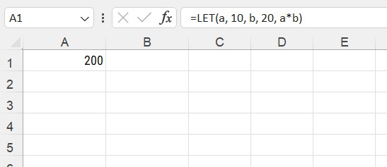

The formula shown in cell A1 is a simple multiplication where the variable named `a` is assigned the value `10` and the variable `b` assigned the value `20`. The last part of the `LET` formula is a multiplication of `a*b` to produce the result shown in the cell - `200`

> The variable names can be any value, but I would suggest not using any of the names used by Excel formulas and keeping the names short.

The variables listed in the formula can refer to cells, table columns, or named ranges.

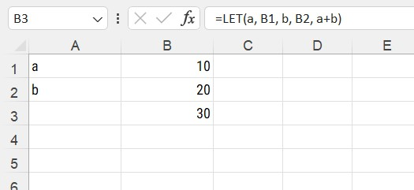

As explained in the standard Excel help, a set of variables and their associated value, values or calculations are created first. The last part of the `LET` formula is any final calculation that is required to provide the desired result.

## The Source Data

The source data we will be using for the examples is shown below. A simple table of just 15 rows of data showing orders made by certain departments in a company, the name of the supplier, the order and ship date along with the amount of the order.


The data is saved in an MS Excel table with the name of `Data` on its own worksheet. We shall be adding a summary of the data by department showing how much each one spent on orders. Over the next several posts we shall expand on what the summary shows and the possible solutions.

## Summary Table LET formula

Before creating our `LET` formula, let's review what we need to evaluate to create our final table of results

1. The values we need to summarise - the `Amount` column in the `Data` table
2. The column of data to summarise by - the `Dept` column in the `Data` table
3. The unique values of the column of data from item 2 above

The variable names we shall use should be simple and easily understood

1. Vals
2. Depts
3. UniqDepts

Before we build out full `LET` formula, lets build each one in turn and check what results we get when we use the variable name as the last parameter of the formula

### The `Vals` variable

As mentioned above, the `Vals` variable will contain all the values we need to sum to produce our summary, the `Amount` column

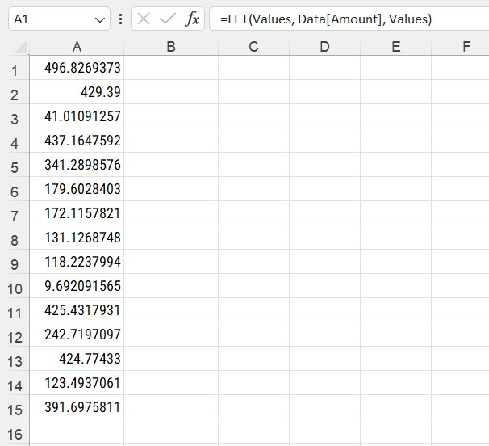

### The `Depts` variable

The `Depts` variable will be the `Department` table column containing the values for each row

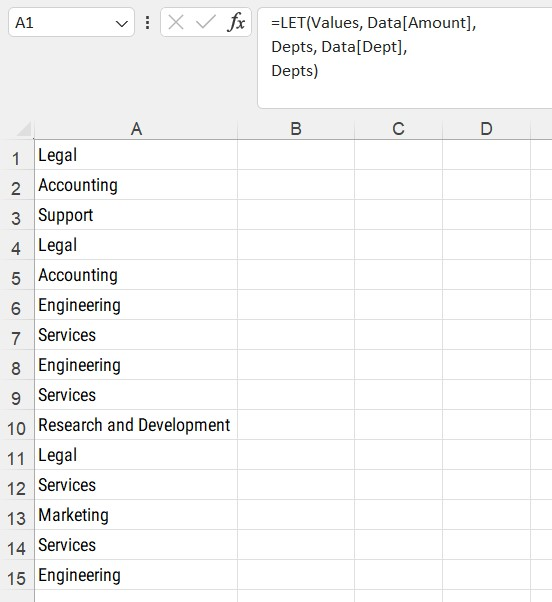

### The `UniqDepts` variable

As mentioned above, the use of the `LET` formula allows us to reuse values from one variable in another. For the list of unique `Dept` values, we can refer to the `Depts` variable created in the previous section.

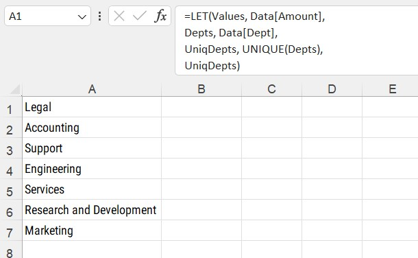

### Putting it all together

To obtain our sum of values to show in our summary, we can use the variable names in the `SUMIF` formula and combine it with the `CHOOSE` formula to create our final table of data, as shown in the [first part](https://gfc-learning.netlify.app/posts/2022-11-15-non-pivotpivots/) of this series.

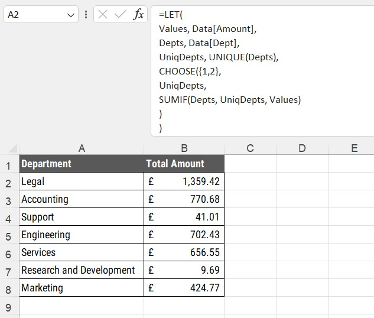

> Add line breaks in the formula by pressing `ALT` + `RETURN`

## Adding a Total Row

To add a total row, we have to resort to some witchcraft and trickery to fool Excel into presenting our final summary.

> Note - Some Excel users may have the `HSTACK` and `VSTACK` formulas available. This method will show how to add totals for those who have not yet had these two formulas made available to them. The method to use the `HSTACK` and `VSTACK` in the next part of this series.

### A Staging worksheet for calculations

For this example we will be using a separate worksheet to stage our formulas before the final presentation of the summary table. The `Staging` worksheet will contain all the required formulas and helper formulas to ensure our final table is in the correct layout.

### Adding a Grand Total Row

To calculate the total of the `Total Amount` column from our example above, we have several methods to obtain the value.

1. Just use a `SUM` formula referencing the `Amount` column in the source data table
2. Use a combination of `SUM` and `INDEX` to reference the `LET` formula created to show the main summary of data

We shall use the second version to obtain our final total amount value. The formula for the total row must be above the main LET formula and column headings. We shall use a trick in a following section to fool Excel into sorting the rows into the correct order

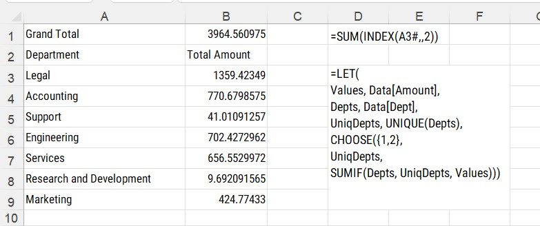

### The SUM INDEX formula

The formula in cell `B2` uses the INDEX formula to refer to the second column of the spilled array in cell A3.

> Note - The # after A3 tell Excel that the formula in the cell is a spilled array.

The `INDEX` formula has three parameters, `array`, `row`, `column`. In our example, we are referring to the spilled array in cell A3 and the second column. With the formula wrapped in a `SUM` formula, we obtain our final grand total value.

### Creating row indices

To sort the rows into the required order, we need to add some further formulas to ensure the rows are sorted correctly.

By using the SEQUENCE formula, we can create a further spilled array to identify the row numbers and use those values to sort the data.

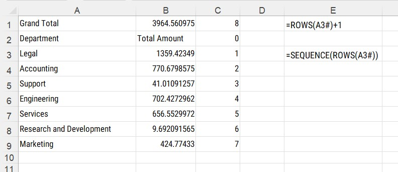

The formula in cell `C8` uses the `ROWS` formula to count the number of rows in the spilled range in cell `A3`, adding one to ensure the total row is at the bottom once sorted

The column header rows have an index of 0 to ensure the headers are at the top once sorted

The individual rows within the main table, have indices based on the position in the table. Using the `SEQUENCE` formula and the `ROWS` formula we can create a spilled range of values in column C.

> Note - the formulas to identify the row index must be in the right hand column with no blank columns between

### Sorting the table rows

Once we have the row index numbers created, we can now sort our table summary into the required order using the `SORTBY` formula.

This formula will sort one range of data by another range of data. In this case we want to sort the data in the range `A1:B9` by the values in the cells `C1:C9`


```{r, layout="l-body-outset", fig.cap="The SORTBY formula"}

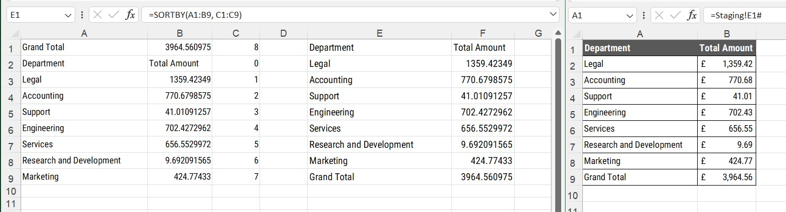

```


The formula in cell `E1` on the left hand window, has the `SORTBY` formula using the ranges mentioned above. The formula in cell `A1` on the right hand window refers to the cell `E1` on the staging worksheet with some additional formatting.

The issue with this method is that if a new department were to be added to the main source data table, the summary table would spill (expand) downwards, but the SORTBY formula would still have a hard-coded range.

#### Tricking SORTBY

The trick to ensure any expanded spilled range is include in a `SORTBY` formula is to use a little known trick when using spilled array formulas.

Usually when selecting a range of cells from the bottom and dragging the mouse cursor upwards, Excel converts the range in a formula to read from the top row to the bottom row. When using spilled arrays, a three part range can be created.

```{r, layout="l-body-outset", fig.cap="The final SORTBY formula"}

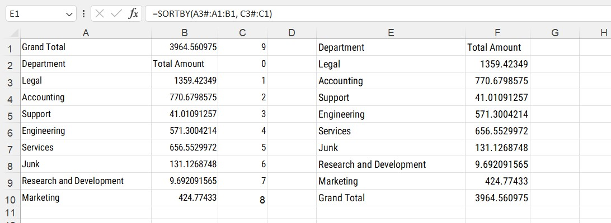

```

The formula in cell `E1` refers to the dynamic range first, then the range of cells for the total row. The `SORTBY` formula then refers to the row index numbers by referring to the spilled `SEQUENCE` formula first.

The row for the column headers are automatically included.

## Adding another summary column

To add another column, say a count of the number of items for each department, just amend the array in the CHOOSE formula in the LET and add the extra calculation.

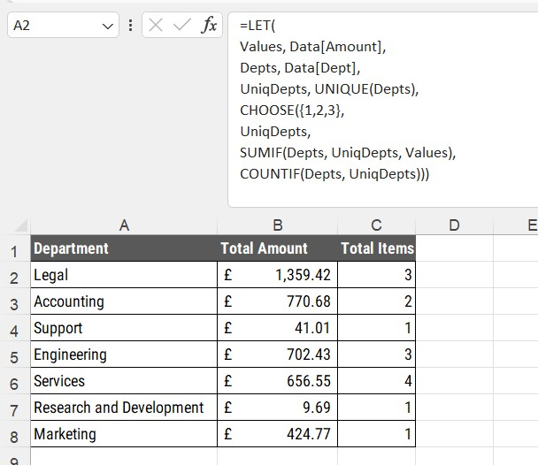

## CHOOSE and SEQUENCE?

While the examples shown in the post use the `CHOOSE` formula to spill columns of data across a range, the `SEQUENCE` formula can also be used rather than a hard-coded array in the first parameter

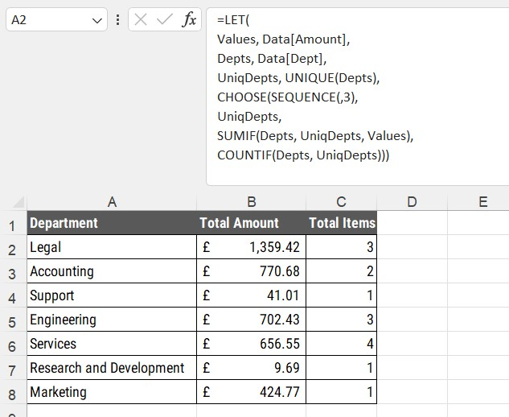

> Note - the first parameter of the `SEQUENCE` formula has been omitted as this refers to rows and the second columns parameter used instead

# Conclusion

This method takes some time to get used to, but once it is understood, creating summary tables that will automatically refresh with new data will come naturally.

In the next part of the series, we will look at how to create this summary of data but using the `HSTACK` and `VSTACK` formulas.


