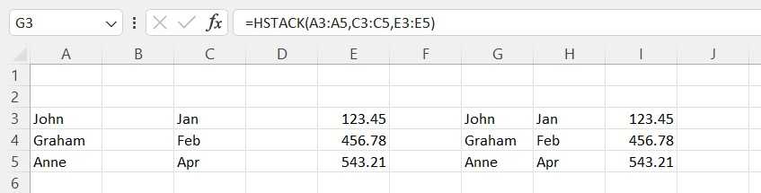
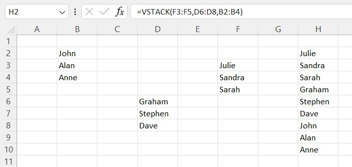
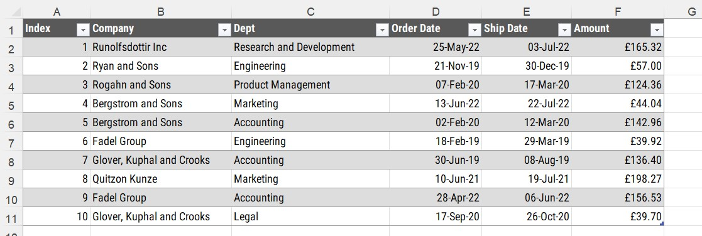
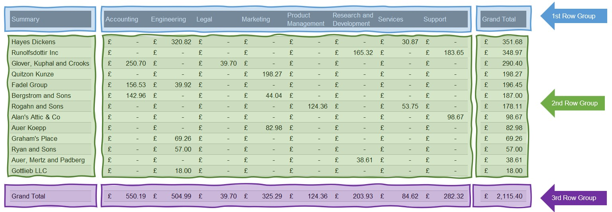
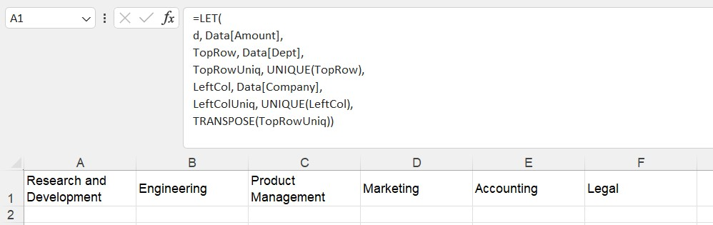
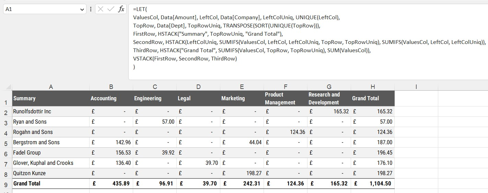

```{r setup, include=FALSE}
knitr::opts_chunk$set(echo = FALSE)
```

```{=html}
<style>
d-article li {
margin-bottom: 2px
}

d-article code {
color: #595959;
background-color:#D9D9D9;
font-size: 100%;
padding:4px 8px;
border-radius: 12px;
}

</style>
```

# The Problem

In the [second part](https://gfc-learning.netlify.app/posts/2022-11-23-non-pivotpivots-part-two/) of this series, we saw how to create a one cell report using the `LET` function and a combination of `SEQUENCE` and `SORTBY` to create a summary table showing the totals of data by department.

In this part we will expand on the process to create a summary of data by Company and Department in a true one cell report.

# The Solution

Spilled arrays in MS Excel give us new powers in summarising data that allow us to do many new and wonderful things with data. Two new(ish) functions now available to users of MS365 are the `HSTACK` and `VSTACK` functions. 

Using these two functions in combination with LET will allow detailed crosstab summary reports to be developed.

## The `HSTACK` function

The H in `HSTACK` stands for Horizontal. The function allows for multiple arrays to be stacked horizontally across a range of cells. In the [previous post](https://gfc-learning.netlify.app/posts/2022-11-23-non-pivotpivots-part-two/#putting-it-all-together), we saw how to use the `CHOOSE` function to spill data cross columns.

The MS Excel Help page for the `HSTACK` function states

> HSTACK returns the array formed by appending each of the array arguments in a column-wise fashion. The resulting array will be the following dimensions:
- **Rows** The maximum of the row count from each of the array arguments.
- **Columns** The combined count of all the columns from each of the array arguments.

A simple example of `HSTACK` would be a joining three separate ranges into one.

```{r, layout="l-body-outset", fig.cap="A simple HSTACK example"}



```

The formula shown in cell `G3` shows that the three ranges in columns `A`, `C` and `E` have been stacked together across the columns `G` to `I`. 

> The ranges used in the `HSTACK` function do not need to be on the same worksheet in the workbook.

## The `VSTACK` function

The V in `VSTACK` stands for Vertical. The function allows for multiple arrays to be stacked on top of each other across a range of rows. In the [previous post](https://gfc-learning.netlify.app/posts/2022-11-23-non-pivotpivots-part-two/#putting-it-all-together), we saw how to use the a combination of the `SEQUENCE`, `ROWS` and `SORTBY` functions to sort a group of rows into the required order. The `VSTACK` function removes the need for those functions to be used.

The MS Excel Help page for the `VSTACK` function states

> VSTACK returns the array formed by appending each of the array arguments in a row-wise fashion. The resulting array will be the following dimensions:
- **Rows** the combined count of all the rows from each of the array arguments.
- **Columns** The maximum of the column count from each of the array arguments.

A simple example of `VSTACK` would be a joining three separate ranges into one.

```{r, layout="l-body-outset", fig.cap="A simple VSTACK formula"}



```

## The Source Data

The source data we will be using for the examples is shown below. A simple table of just 10 rows of data showing orders made by certain departments in a company, the name of the supplier, the order and ship date along with the amount of the order.

```{r, layout="l-body-outset", fig.cap="Source data"}

```

## How to arrange the data

Before we start to build out our `LET` formula, we need to think about how the data will need to be arranged using the `HSTACK` and `VSTACK` functions inside the `LET` formula.

The image below gives an idea of what needs to be in each area of a summary table.

```{r, layout="l-body-outset", fig.cap="Data arrangment"}

```

In this example, the three row groups will be created using the `HSTACK` function and will then be used within a `VSTACK` function to create the final summary table.

## Build initial `LET` function

Before we start to use the two stacking functions, let's build out our initial `LET` function with the required variables and columns of data.

The three columns from the source data table that will be used are the `Company`, `Department` and the `Amount` columns. As shown in part two, the `LET` function allows fro variables to be created and data ranges assigned to them. Using these columns and the `LET` function, our initial formula is shown below.

```{r, layout="l-body-outset", fig.cap="The initial LET formula"}

```

## First Row

For our summary table, we need to have the names of the `Department` column from our source data, along with a title for the summary and a Grand Total column at the right hand side.

Creating this formula outside of the `LET` function would be

```veratim
=HSTACK("Summary", TRANSPOSE(SORT(UNIQUE(Data[Dept]))), "Grand Total")
```

## Second Row

The second row will contain the main chunk of the data, listing the `Company` names, the total amounts for each `Company` and `Department` combination and a grand total row for each `Company`.

```verbatim
=HSTACK(LeftColUniq, SUMIFS(ValuesCol, LeftCol, LeftColUniq, TopRow, TopRowUniq), SUMIFS(ValuesCol, LeftCol, LeftColUniq))
```

## Third Row

The final row will contain the grand total row for each `Department`, along with the overall total for all rows.

```verbatim
=HSTACK("Grand Total", SUMIFS(ValuesCol, TopRow, TopRowUniq), SUM(ValuesCol))
```
## Putting it all together

Using the `VSTACK` function, and placing the `HSTACK` formulas, along with out initial variables, the final table is created.

```{r, layout="l-body-outset", fig.cap="The final formula"}

```
# Conclusion

Using a combination of the `LET`, `VSTACK` and `HSTACK` formulas, a flexible method of summarising data can be reduced to one formula in one cell. With the added benefit of the summary will automatically refresh when new data is added, the need for pivot tables and people (managers) messing with the layout is removed.


