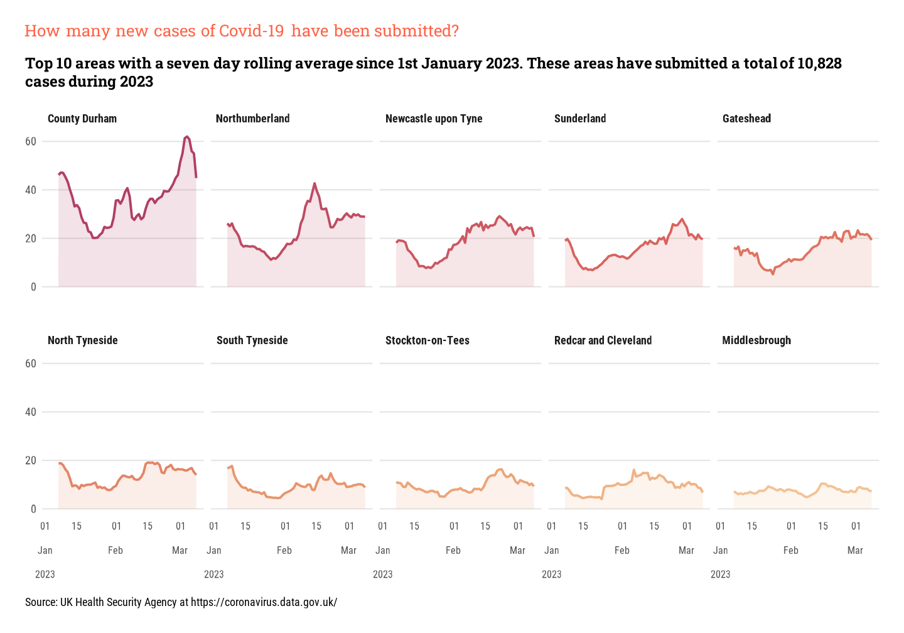

```{r setup, include=FALSE}
knitr::opts_chunk$set(echo = FALSE)

pacman::p_load("dplyr", "tidyr", "stringr", "lubridate",
        "readr", "ggplot2", "tibble", "forcats", "scales", "ggtext",
        "showtext", "ggpubr", "zoo")

```

```{=html}
<style>
d-article li {
margin-bottom: 2px
}

d-article pre {
color: #595959;
background: #D9D9D9;
font-size: 70%
}
</style>
```

# Overview

In [part one](https://gfc-learning.netlify.app/posts/2023-03-02-covid-visualisationpart-one/) we downloaded data from the UK Government's Health Security Agency Covid-19 Dashboard website. 

# Load Data

The data is now only updated weekly, so a CSV file with the data was saved to remove the need for daily downloads of data.

```{r eval=TRUE, echo=TRUE}
df <- read_csv("all_areas.csv")
```

```{r eval=TRUE, echo=FALSE}
head(df)
```

# Transform Data

## Top Ten Areas

For the plots that will be created for this post, we need to look for the top ten areas, or counties, in England and Wales, so we can plot the data for 2023.

```{r eval=TRUE, echo=TRUE}
top_ten_all_areas_df <- df %>%
  
  # Filter data for just 2023
	filter(date >= as.Date("2023-01-01")) %>%
  
  # Group by area_name variable
	group_by(area_name) %>%
  
  # Calculate total number of cases by area_name
	summarise(cases = sum(new_cases_by_specimen_date)) %>%
  
  # Sort in descending order
	arrange(-cases) %>%
  
  # Get the top ten items
	top_n(10) 
```

```{r eval=TRUE, echo=FALSE}
top_ten_all_areas_df
```

# Create Plot

## Create Plot Labels

We can now add some labels with some descriptive text explaining the chart to the viewer.

```{r eval=FALSE, echo=TRUE}

# Calculate the total number of cases for use in plot subtitle
total_cases <- comma(sum(top_ten_all_areas_df$cases))

title_text <- "How many new cases of Covid-19 have been submitted?"

subtitle_text <- paste(
			"Top 10 areas with a seven day rolling average since 1st January 2023. 
			These areas have submitted a total of",
			total_cases,
			"cases during 2023"
		)

caption_text <- "Source: UK Health Security Agency at https://coronavirus.data.gov.uk/"
```

## Create Colour Palette

Create a new palette of colours using the `colorspace` package to remove the standard `ggplot2` colour palette.

```{r eval=FALSE, echo=TRUE}
# Create colour palette using the RedOr (Red-Orange) palette
pal <- colorspace::sequential_hcl(n = 10, palette = "redor")
```

Now we have the data loaded, labels created and a new colour palette, let's create our plot. For this plot we shall use the `rollmean` function from the `zoo` package to create a 7 day rolling average to use in the plot.

```{r eval=FALSE, echo=TRUE}
df %>%
  
  # Filter for this year's data and for areas found in the
  # top_ten_all_areas_df tibble
	filter(date >= as.Date("2023-01-01"),
				 area_name %in% top_ten_all_areas_df$area_name) %>%
  
  # Mutate the area_name to a factor and reorder by the order
  # in the top_ten_all_areas_df
	mutate(area_name = area_name %>%
				 	fct_reorder(new_cases_by_specimen_date, sum) %>%
				 	fct_rev()
	) %>%
  
  # Group by area_name and date
	group_by(area_name, date) %>%
  
  # Calculate the total number of cases
	summarise(cases = sum(new_cases_by_specimen_date)) %>%
  
  # Calculate the rolling seven day average using the rollmean function
	mutate(roll_seven =
				 rollmean(cases, k = 7, na.pad = TRUE, align = "right", fill = NA)
	) %>%
  
  ## Create initial plot
	ggplot(aes(date, roll_seven)) +
  
  # Add an area geom with transparency of 45%
	geom_area(aes(fill = area_name),
						show.legend = FALSE,
						alpha = .15) +
  
  # Add a line geom, which will show at the top of the geom_area
	geom_line(aes(colour = area_name),
						show.legend = FALSE,
						linewidth = .9) +
  
  # Assign colours from the custom palette for the geom_lines
	scale_colour_manual(values = pal) +
  
  # Assign colours from the custom palette to the geom_areas
	scale_fill_manual(values = pal) +
  
  # Amend x axis labels and limits
	scale_x_date(labels = label_date_short(),
							 limits = as.Date(c(("2023-01-03"), NA))) +
  
  # Facet data by area_name with two rows of five charts
	facet_wrap( ~ area_name, nrow = 2) +
  
  # Amend the theme
	theme(
		panel.grid.major.y = element_line(colour = "grey90"),
		panel.spacing.x = unit(0.2, "cm"),
		strip.text = element_text(hjust = 0, face = "bold"),
		axis.title.y = element_blank(),
		axis.title.x = element_blank(),
		axis.text.x = element_text(size = 8)
	) +
  
  # Add plot labels
	labs(
		title = title_text,
		subtitle = subtitle_text,
		caption = caption_text
	)
```

```{r, layout="l-body-outset", fig.cap="A facet plot of the Top Ten Areas in England & Wales"}

```

## Filtering for North East England

To filter the data for the area of the UK where I live, we can filter the data on the initial loading. First, create a vector of area names in North East England

```{r eval=FALSE, echo=TRUE}
# Create list of areas to use in the filter
areas <- c(
  "Hartlepool","Middlesbrough","Redcar and Cleveland",
  "Stockton-on-Tees","Darlington","County Durham",
  "Northumberland","Newcastle upon Tyne","North Tyneside",
  "South Tyneside","Sunderland","Gateshead"
  )
```

Apply the filter when the data is initially loaded.

```{r eval=FALSE, echo=FALSE}
df <- read_csv(paste("01_data/", file, sep = ""),
							 show_col_types = FALSE) %>%
	filter(area_name %in% areas)
```

The steps outlined in the previous sections can then be followed once more to create the plot below.

```{r, layout="l-body-outset", fig.cap="A facet plot of the Top Ten Areas in North East England"}

```

# Conclusion

In this post we looked at the top ten areas in both England & Wales as a whole and the in the North East England.

In the next post, data will be shown in a choropleth map showing the areas of England and Wales by the number of Covid-19 cases. 
