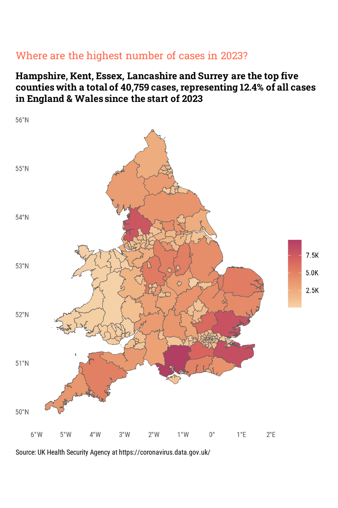
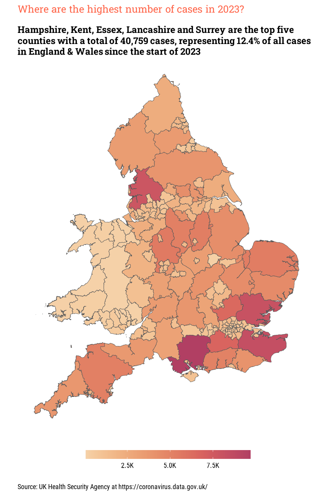
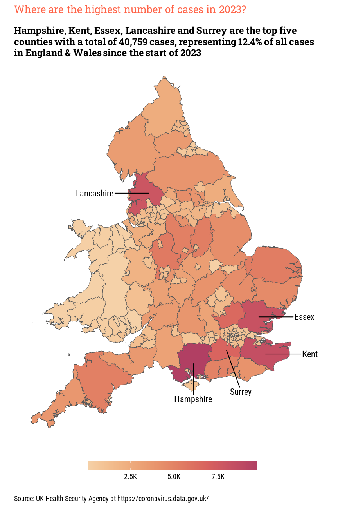
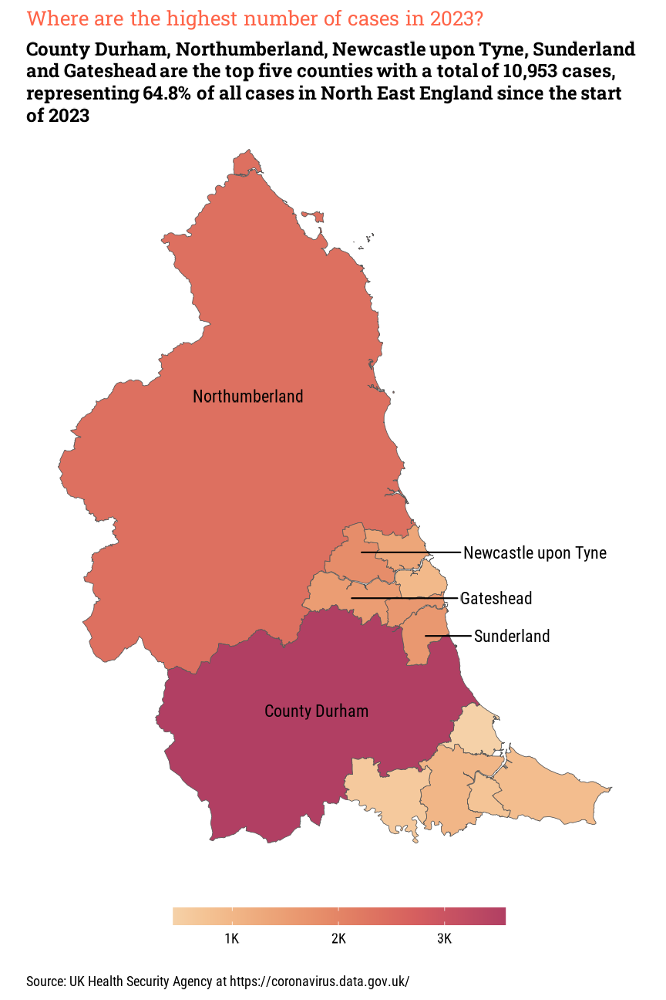

```{r setup, include=FALSE}
knitr::opts_chunk$set(echo = FALSE)

pacman::p_load("dplyr", "tidyr", "stringr", "lubridate",
        "readr", "ggplot2", "tibble", "ggtext",
        "showtext", "ggpubr")

```

```{=html}
<style>
d-article li {
margin-bottom: 2px
}

d-article pre {
color: #595959;
background: #D9D9D9;
font-size: 70%
}
</style>
```

# Overview

In [part two](https://gfc-learning.netlify.app/posts/2023-03-14-covid-visualisation-part-two/){target="_blank"} we downloaded data from the UK Government's Health Security Agency Covid-19 Dashboard website. 

# Load Data

The data is now only updated weekly, so a CSV file with the data was saved to remove the need for daily downloads of data.

```{r eval=TRUE, echo=TRUE}
df <- read_csv("all_areas.csv")
```

```{r eval=TRUE, echo=FALSE}
head(df)
```

# Transform Data

## Top Ten Areas

For the plots that will be created for this post, we need to look for the top five areas, or counties, in England and Wales, so we can plot the labels to the final map.

```{r eval=TRUE, echo=TRUE, attr.source='.numberLines'}
top_ten_all_areas_df <- df %>%
  
  # Filter data for just 2023
	filter(date >= as.Date("2023-01-01")) %>%
  
  # Group by area_name variable
	group_by(area_name) %>%
  
  # Calculate total number of cases by area_name
	summarise(cases = sum(new_cases_by_specimen_date)) %>%
  
  # Sort in descending order
	arrange(-cases) %>%
  
  # Get the top five items
	mutate(lbl = if_else(row_number() <= 5, TRUE, FALSE)) 
```

```{r eval=TRUE, echo=FALSE}
top_ten_all_areas_df
```

# Create Plot

## Create Plot Labels

We can now add some labels with some descriptive text explaining the chart to the viewer.

```{r eval=FALSE, echo=TRUE}

# Create title
title_text <- 
  "How many new cases of Covid-19 have been submitted?"

# Create subtitle
subtitle_text <- 
  paste(
    top_area_names,
    "are the top five counties with a total of",
    comma(top_area_counts),
    "cases, representing",
    top_area_pct,
    "of all cases in England & Wales since the start of 2023"
  )

# Create caption
caption_text <- "Source: UK Health Security Agency at
https://coronavirus.data.gov.uk/"
```

## Create Colour Palette

Create a new palette of colours using the `colorspace` package to remove the standard `ggplot2` colour palette.

```{r eval=FALSE, echo=TRUE}
# Create colour palette using the RedOr (Red-Orange) palette
pal <-
	colorspace::sequential_hcl(
	  length(unique(df$area_name)), 
	  palette = "redor", 
	  rev = TRUE)
```

## Join to Map Data

Now we have the data loaded, labels created and a new colour palette, we now need to join the data to the map data. Using the `sf` package, we can read the shape file saved in the same directory as the source data.

```{r eval=FALSE, echo=TRUE}

# Read the shape file into new data frame
counties <-
	sf::st_read(
		"Counties_and_Unitary_Authorities_(December_2016)_Boundaries.shp"
	)

```

Now we can join the data from the shape file to the data frame containing the data we want to map

```{r eval=FALSE, echo=TRUE}
counties <- counties %>% 
  inner_join(df, c("ctyua16cd" = "area_code"))
```

# Create Plot

## Basic plot

Now we have the data loaded, labels created and a new colour palette, let's create our plot. 

```{r eval=FALSE, echo=TRUE}

ggplot(counties) +
  geom_sf(aes(fill = cases), size = .4) +
  
  labs(title = title_text,
       subtitle = subtitle_text,
       caption = caption_text) +
  scale_fill_gradientn(
    colours = pal,
    labels = label_number(scale_cut = cut_short_scale()),
    guide = guide_colorbar(title = NULL)
  )

```

```{r, layout="l-body-outset", fig.cap="Top Ten Areas in England & Wales"}

```

## Amend theme and legend

Let's remove the axis labels for the coordinates and amend the legend and move to the bottom of the plot.

```{r eval=FALSE, echo=TRUE}

ggplot(counties) +
  geom_sf(aes(fill = cases), size = .4) +
  
  labs(title = title_text,
       subtitle = subtitle_text,
       caption = caption_text) +
  scale_fill_gradientn(
    colours = pal,
    labels = label_number(scale_cut = cut_short_scale()),
    guide = guide_colorbar(title = NULL)
  ) +
  theme(
		plot.margin = margin(rep(.25, 4), unit = "cm"),
		plot.subtitle = element_textbox_simple(margin = margin(t = 1)),
		axis.text = element_blank(),
		axis.title = element_blank(),
		legend.position = "bottom",
		legend.direction = "horizontal",
		legend.key.height = unit(.8, units = "lines"),
		legend.key.width = unit(3, units = "lines")
	) 

```

```{r, layout="l-body-outset", fig.cap="Top Ten Areas in England & Wales with amended legend"}

```

## Add labels

For someone outside of the United Kingdom, the county names in the subtitle will be meaningless if the location of those counties are not known. Let's add some labels for the top five counties using the `ggrepel` package. 

```{r eval=FALSE, echo=TRUE}

ggplot(counties) +
  geom_sf(aes(fill = cases), size = .4) +
  
  labs(title = title_text,
       subtitle = subtitle_text,
       caption = caption_text) +
  scale_fill_gradientn(
    colours = pal,
    labels = label_number(scale_cut = cut_short_scale()),
    guide = guide_colorbar(title = NULL)
  ) +
  theme(
		plot.margin = margin(rep(.25, 4), unit = "cm"),
		plot.subtitle = element_textbox_simple(margin = margin(t = 1)),
		axis.text = element_blank(),
		axis.title = element_blank(),
		legend.position = "bottom",
		legend.direction = "horizontal",
		legend.key.height = unit(.8, units = "lines"),
		legend.key.width = unit(3, units = "lines")
	) +
  ggrepel::geom_text_repel(
		data = counties %>% filter(lbl == TRUE),
		aes(x = long, y = lat, label = area_name),
		nudge_x = c(1.28, 0, 1.25, -1.5, .4),
		nudge_y = c(0,-.6, 0, 0, -.7),
		family = "roboto-condensed"
	)

```

```{r, layout="l-body-outset", fig.cap="Top Ten Areas in England & Wales with amended legend and county labels"}

```

## Filtering for North East England

To filter the data for the area of the UK where I live, we can filter the data on the initial loading. First, create a vector of area names in North East England

```{r eval=FALSE, echo=TRUE}
# Create list of areas to use in the filter
areas <- c(
  "Hartlepool","Middlesbrough","Redcar and Cleveland",
  "Stockton-on-Tees","Darlington","County Durham",
  "Northumberland","Newcastle upon Tyne","North Tyneside",
  "South Tyneside","Sunderland","Gateshead"
  )
```

Apply the filter when the data is initially loaded.

```{r eval=FALSE, echo=FALSE}
df <- read_csv(paste("01_data/", file, sep = ""),
							 show_col_types = FALSE) %>%
	filter(area_name %in% areas)
```

The steps outlined in the previous sections can then be followed once more to create the plot below.

The values for the `nudge_x` parameter in the `ggrepel::geom_text_repel` need to be amended for the new top five counties. We can remove the `nudge_y` parameter as the areas to be labelled will be far enough apart without the need to vertically amend the location of the label.

```{r eval=FALSE, echo=TRUE}
nudge_x = c(0, 0, .6, .3, .5)
```

```{r, layout="l-body-outset", fig.cap="A facet plot of the Top Ten Areas in North East England"}

```

# Conclusion

In this post we looked at the top ten areas in both England & Wales as a whole and the in the North East England and mapped the values to a map using the `sf` package.

The values used by the `nudge_x` and `nudge_y` parameters in the `geom_text_repel` were manually calculated by trial and error, amending the values with each iteration of preparing the images for this post. While not my preferred method, it was a good learning exercise.

In the next post, we will look at the actual numbers of cases submitted for Covid-19 as these values have not been shown in any of the previous posts.
