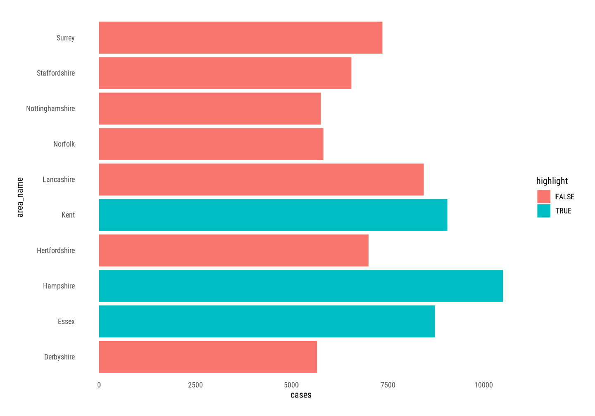
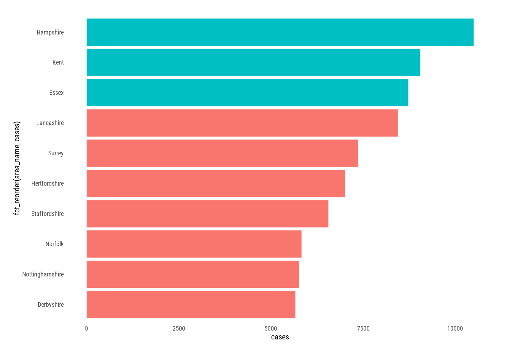
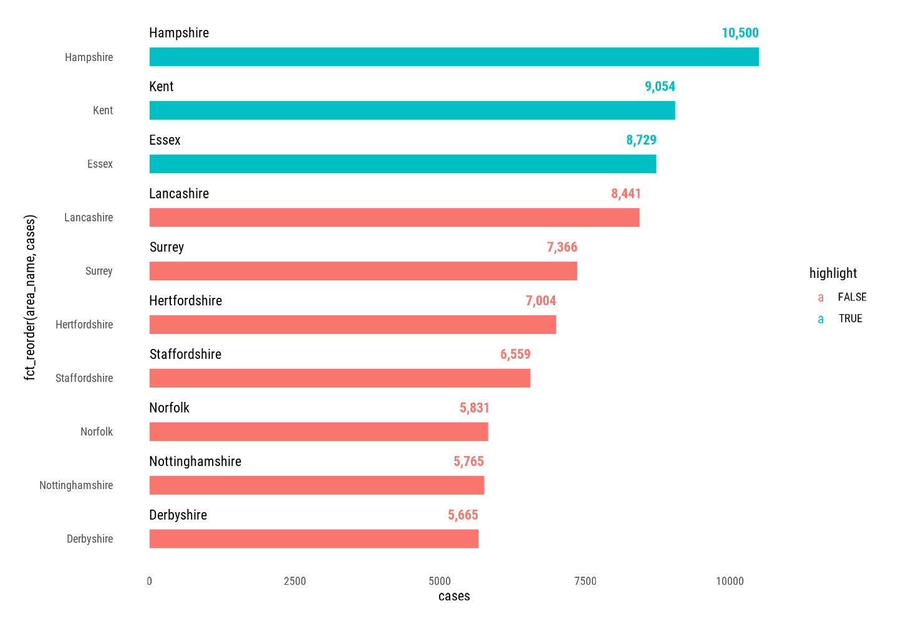
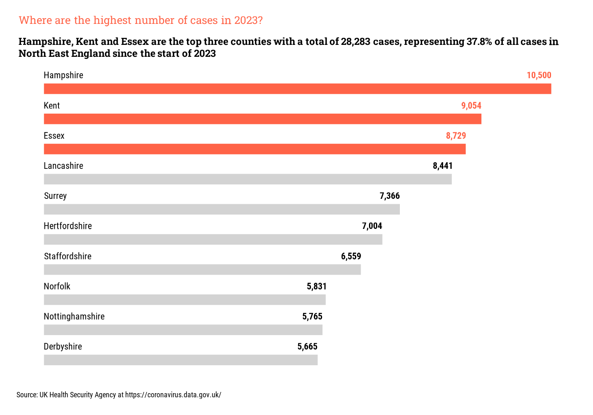
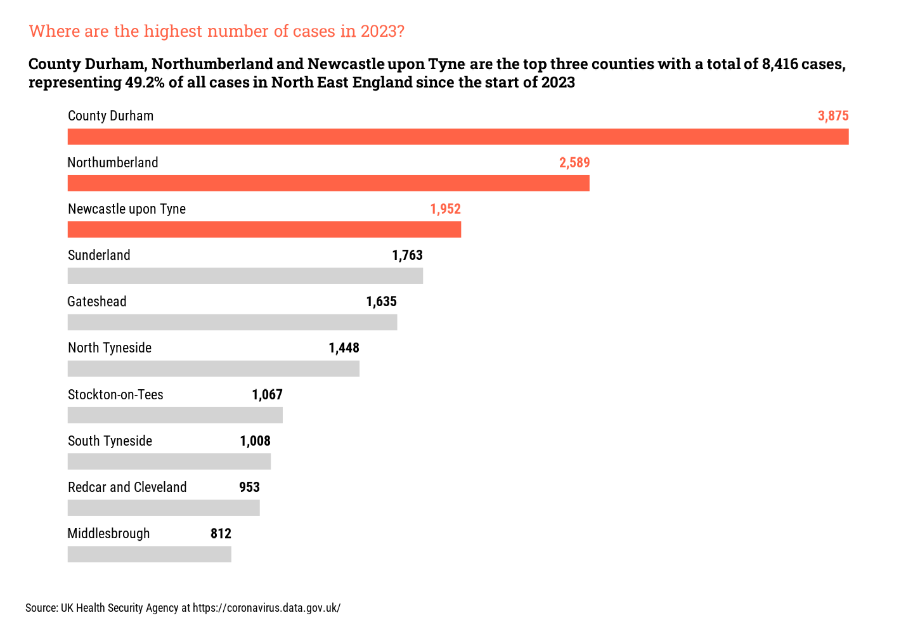

```{r setup, include=FALSE}
knitr::opts_chunk$set(echo = FALSE)

pacman::p_load("dplyr", "tidyr", "stringr", "lubridate",
        "readr", "ggplot2", "tibble", "ggtext",
        "showtext", "ggpubr")

```

```{=html}
<style>
d-article li {
margin-bottom: 2px
}

d-article pre {
color: #595959;
background: #D9D9D9;
font-size: 70%
}
</style>
```

# Overview

In previous parts of this series on visualising Covid-19 data, we downloaded data from the UK Government's Health Security Agency Covid-19 Dashboard website and plotted the data in a variety of methods, but none of these have included the actual numbers of cases submitted.

## Load Data

```{r eval=TRUE, echo=TRUE}
df <- read_csv("all_areas.csv")
```

```{r eval=TRUE, echo=FALSE}
head(df)
```

# Transform Data

## Top Ten Areas

Once again, we will be creating plots for the top ten areas in this post.

```{r eval=TRUE, echo=TRUE}
df <- df %>%
  
  # Filter data for just 2023
  filter(date >= as.Date("2023-01-01")) %>%
  
  # Select the columns to use
	select(area_name, cases = new_cases_by_specimen_date) %>%
  
  # Group by the area name
	group_by(area_name) %>%
  
  # Calculate total number of cases by area_name
	summarise(cases = sum(cases)) %>%
  
  # Sort in descending order
	arrange(-cases) %>%
  
  # Get the top ten items
	top_n(n = 10, wt = cases) %>%
  
  # Add a new variable to identify the top three items
	mutate(highlight = ifelse(row_number() <= 3, TRUE, FALSE))

```

```{r eval=TRUE, echo=FALSE}

df

```

# Create Plot

### Create Plot Labels

As previously, we can now create the labels with some descriptive text explaining the chart to the viewer.

```{r eval=FALSE}
# Create labels for subtitle
total_cases <- sum(df$cases)

top_areas <- toString(pull(df[df$highlight == TRUE, "area_name"]))

top_area_names <- sub(",([^,]*)$", " and\\1", top_areas)

top_area_counts <- sum(df[df$highlight == TRUE, "cases"])

top_area_pct <- percent(top_area_counts / total_cases, accuracy = .2)

# Create main title
title_text <- "Where are the highest number of cases in 2023?"

# Create subtitle
subtitle_text <-
	paste(
		top_area_names,
		"are the top three counties with a total of",
		comma(top_area_counts),
		"cases, representing", top_area_pct, "of all cases in", region, "since the start of 2023"
	)

# Create caption
caption_text <-
	"Source: UK Health Security Agency at https://coronavirus.data.gov.uk/"

```

### Create Basic Plot

```{r eval=FALSE, echo=TRUE}
df %>%
  
  # Create plot adding the highlight variable as the fill colour
	ggplot(aes(x = cases, y = area_name, fill = highlight)) +
  
  # Add column geometry
	geom_col()

```

```{r, layout="l-body-outset", fig.cap="Basic plot"}

```

### Reorder Area Names

The order in which the names of each area appears should be in descending order, with the highest value at the top of the plot.

```{r eval=FALSE, echo=TRUE}
df %>%
  
  # Create plot adding the highlight variable as the fill colour 
  # and reorder the area_name using fct_reorder
	ggplot(aes(cases, fct_reorder(area_name, cases), fill = highlight)) +
  
  # Add column geometry and remove the legend
	geom_col(show.legend = FALSE)

```

```{r, layout="l-body-outset", fig.cap="Basic plot with re-ordered area names"}

```

### Add Data Labels

We can now add the actual numbers of each bar.

```{r eval=FALSE, echo=TRUE}

df %>%
  
  # Create plot adding the highlight variable as the fill colour 
  # and reorder the area_name using fct_reorder
	ggplot(aes(cases, fct_reorder(area_name, cases), fill = highlight)) +
  
  # Add column geometry and remove the legend
	geom_col(show.legend = FALSE) +
  
  # Add text geometry to plot
	geom_text(aes(cases, area_name, label = cases), hjust = 0)
```

```{r, layout="l-body-outset", fig.cap="Basic plot with re-ordered area names and data labels"}

```

### Reimagine the plot

Now we have the bars in the correct order, along with the data labels, now we can re-imagine the plot into something a little different.

If we remove the labels on the y axis and have them above the actual bar, along with the data label, we can have an original plot.

```{r eval=FALSE, echo=TRUE}

df %>%
  
  # Create plot adding the highlight variable as the fill colour
  # and reorder the area_name using fct_reorder
  ggplot(aes(cases, fct_reorder(area_name, cases), fill = highlight)) +
  
  # Add column geometry and remove the legend and amend the
  # width of the column
  geom_col(width = .35, show.legend = FALSE) +
  
  # Add label for the area name and amend position by nudge upwards
  # to be above bar and ensure ordering is the same with fct_reorder
  # Also amend the font family to match other plot elements
  geom_text(
    aes(
      x = 0,
      y = fct_reorder(area_name, cases),
      label = area_name
    ),
    hjust = 0,
    position = position_nudge(y = .45),
    family = "roboto-condensed"
  ) +
  
  # Add label for the number of cases and amend position by nudge upwards and
  # to the left and above bar. Ensure ordering is the same with fct_reorder
  # Also amend the font family to match other plot elements
  geom_text(
    aes(
      x = cases,
      y = fct_reorder(area_name, cases),
      label = comma(cases),
      colour = highlight
    ),
    fontface = "bold",
    hjust = 1,
    position = position_nudge(x = -.4, y = .45),
    family = "roboto-condensed"
  )

```

```{r, layout="l-body-outset", fig.cap="Reworked plot with re-ordered area names and data labels"}

```

### The Final Plot

We can now remove the labels on the y-axis and amend the other elements using the `theme` command and add the labels to the plot. The colour of the bars and data labels can also be amended

```{r eval=FALSE, echo=TRUE}
df %>%
  
  # Create plot adding the highlight variable as the fill colour
  # and reorder the area_name using fct_reorder
  ggplot(aes(cases, fct_reorder(area_name, cases), fill = highlight)) +
  
  # Add column geometry and remove the legend and amend the
  # width of the column
  geom_col(width = .35, show.legend = FALSE) +
  
  # Add label for the area name and amend position by nudge upwards
  # to be above bar and ensure ordering is the same with fct_reorder
  # Also amend the font family to match other plot elements
  geom_text(
    aes(
      x = 0,
      y = fct_reorder(area_name, cases),
      label = area_name
    ),
    hjust = 0,
    position = position_nudge(y = .45),
    family = "roboto-condensed"
  ) +
  
  # Add label for the number of cases and amend position by nudge upwards and
  # to the left and above bar. Ensure ordering is the same with fct_reorder
  # Also amend the font family to match other plot elements
  geom_text(
    aes(
      x = cases,
      y = fct_reorder(area_name, cases),
      label = comma(cases),
      colour = highlight,
      fontface = "bold"
    ),
    hjust = 1,
    position = position_nudge(x = -.4, y = .45),
    family = "roboto-condensed"
  ) +
  
  # Amend the colour of the bars to more suitable colours
  scale_fill_manual(values = c("tomato", "lightgrey"),
                    breaks = c(TRUE, FALSE)) +
  
  # Amend colour of data labels
  scale_colour_manual(values = c("tomato", "black"),
                      breaks = c(TRUE, FALSE)) +
  
  # Amend theme elements
  theme(
    axis.text = element_blank(),
    axis.title = element_blank(),
    legend.position = "none",
    plot.title.position = "panel"
  ) +
  
  # Add final labels
  labs(title = title_text,
       subtitle = subtitle_text,
       caption = caption_text)
```

```{r, layout="l-body-outset", fig.cap="Final plot with amended colours and elements"}

```

## Filtering data for North East England

Now we have the final plot, let's filter the main dataset for only those areas in North East England.

<aside>
Labels will also be recalculated once the dataset has been filtered for only these area names.
</aside>

```{r eval=FALSE, echo=TRUE}

# Create list of areas to use in the filter
areas <- c(
  "Hartlepool","Middlesbrough","Redcar and Cleveland",
  "Stockton-on-Tees","Darlington","County Durham",
  "Northumberland","Newcastle upon Tyne","North Tyneside",
  "South Tyneside","Sunderland","Gateshead"
  )

# Add filter for areas to the initial pipeline of commands 

filter(date >= as.Date("2023-01-01"), area_name %in% areas) %>%

```

```{r, layout="l-body-outset", fig.cap="Final plot for North East England"}

```

# Conclusion

Exploring different and new methods of visualising data has been fun and will certainly be using these techniques with other datasets.

The next post will be back to MS Excel and some tips and tricks for using the new dynamic spilled arrays.
