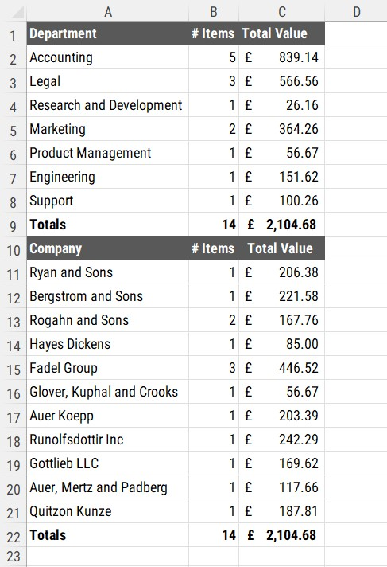
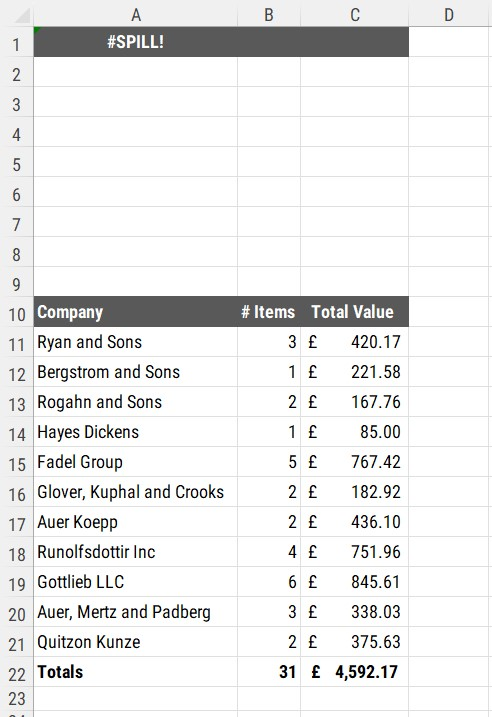
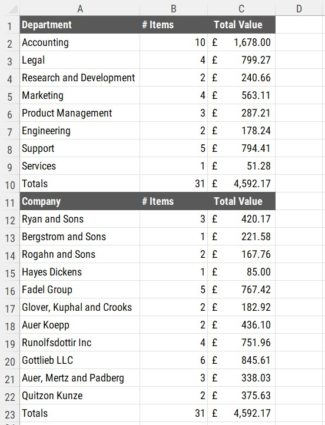
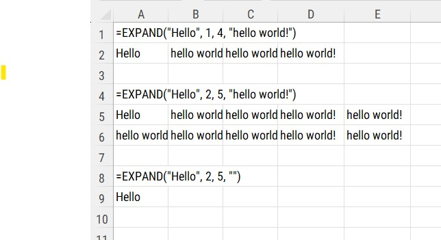
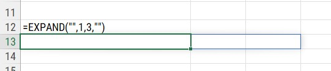
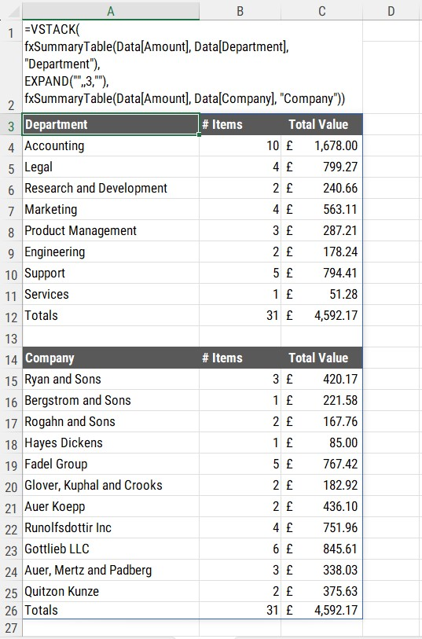
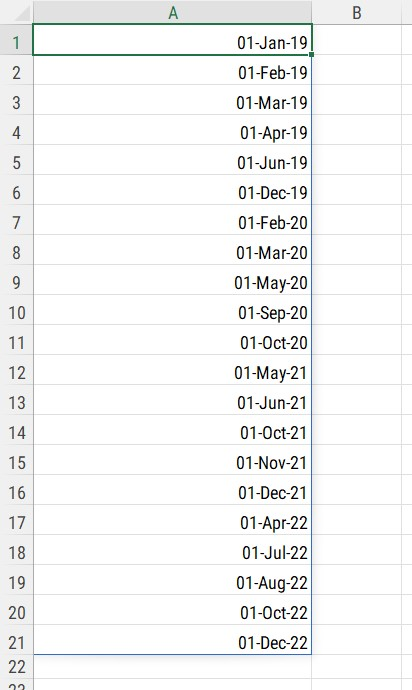
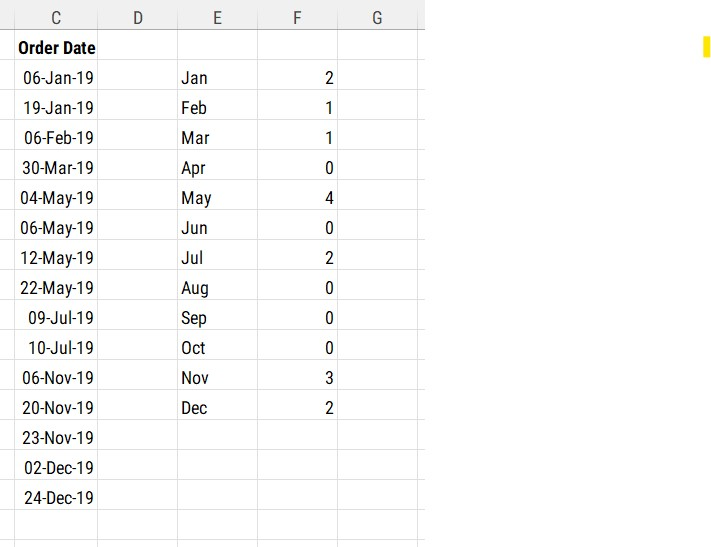

```{r setup, include=FALSE}
knitr::opts_chunk$set(echo = FALSE)
```

```{=html}
<style>
d-article li {
margin-bottom: 2px
}

d-article code {
color: #595959;
background-color:#D9D9D9;
padding:4px;
}

d-title {
background-image: url("header.jpg");
}

</style>
```

# The Mysterious EXPAND Function

When I first saw this function, I was not sure there would be a use for using the function.

<aside>
More on `LAMBDA` functions in the next post.
</aside>

When looking at presenting summary tables of data on a worksheet, I had developed a `LAMBDA` function, named `fxSummaryTable` to show summaries of data.


> =LAMBDA(Values,LeftCol,Label,  
        LET(  
          LeftColUniq, UNIQUE(LeftCol),   
          Header, HSTACK(Label, "# Items", "Total Value"),  
          Body, HSTACK(  
            LeftColUniq,   
            COUNTIF(LeftCol, LeftColUniq),  
            SUMIF(LeftCol, LeftColUniq, Values)  
            ),   
          Footer, HSTACK("Totals", ROWS(LeftCol), SUM(Values)),   
        VSTACK(Header, Body, Footer)  
        )  
      )  


```{r, fig.cap="Two LAMBDA functions"}

```

When new data was added, a `#SPILL` error was shown as the top spilled array would overlap another one further down the worksheet.

```{r, fig.cap="#SPILL Error"}

```

As these two summaries have been created with `LAMBDA` custom functions, the two can be combined by using the `VSTACK` function.

<aside>
See [this post](https://gfc-learning.netlify.app/posts/2022-11-23-non-pivotpivots-part-two/){target="_blank"} for more details on using the `VSTACK` function.
</aside>

```{r, fig.cap="Using VSTACK with spilled arrays"}

```

Investigating the `EXPAND` function further, I realised that this could be used in conjunction with the two spilled arrays to prevent a `#SPILL` error.

## What does the EXPAND function actually do?

Looking at the Microsoft help pages for the function, it states:

> Expands or pads an array to specified row and column dimensions.

The function can be used to create blank rows by using the formula below.

```{r, fig.cap="EXPAND Examples"}

```

- The first parameter is the value that will appear in the left hand column
- The second parameter is the number of rows
- The third parameter is the number of columns
- The last parameter is what to show in the columns (or rows) after the first cell

As shown in the last example above, by adding double quotes for the first and last parameters, we can create an array that would be a blank row.

```{r, fig.cap="Create a blank row"}

```
## The Final Formula

By using the `EXPAND` function between the two `LAMBDA` functions in the `VSTACK` as shown above, we can create a blank row between the two summary tables of data

> =VSTACK(  
  fxSummaryTable(Data[Amount], Data[Department], "Department"),  
  EXPAND("",,3,""),  
  fxSummaryTable(Data[Amount], Data[Company], "Company"))  

```{r, fig.cap="Final VSTACK formula"}

```

# Converting Month Index Numbers

One of the struggles when using `LAMBDA` functions along with `LET` functions is when a column of dates are required in the calculation.

To count the number of items in a particular month, the formula below could be used.

> LET(
  Dates, Data[Order Date],  
  UniqueDates, SORT(UNIQUE(EOMONTH(--Dates, -1)+1)),  
  UniqueDates  
  )
  
  
The disadvantage of using this method is that it will only return months where there is a value for that month, as below.

```{r, fig.cap="List of months"}

```

As shown in the image above, there are many months missing and the result of the formula does not return a continuous list of month values.

## The Magic of 29

Excel dates start from 1st January 1900. This is Day One in the world of Excel. Today, 9th May 2022, when I am writing this post, is 45055.

By using a sequence of numbers from 1 to 12, we can convert these to month names. By multiplying each number from 1 to 12 by 29, the result will return the 29th of every month. Using the `TEXT` function, we can convert those values to month names.

<aside>
29th February...Yes, that only occurs in leap years. Thankfully, Excel is clever enough to realise this.
</aside>

> =TEXT(SEQUENCE(12), "MMM")

## The Final LET Formula

For our final formula, we can use this to create the month labels in a `LET` formulas

> =LET(Dates, C2:C16,  
  Mths, SEQUENCE(12),  
  HSTACK(  
  TEXT(Mths*29, "MMM"),  
  COUNTIFS(Dates, ">="&DATE(2019, Mths, 1), Dates, "<="&EOMONTH(DATE(2019, Mths,1),0)))  
  )  

```{r, fig.cap="List of months"}

```


