```{r setup, include=FALSE}
knitr::opts_chunk$set(echo = FALSE)
```

```{=html}
<style>
d-article li {
margin-bottom: 2px
}

d-article code {
color: #595959;
background-color:#D9D9D9;
padding:4px;
}

d-title {
background-image: url("header.jpg");
}

</style>
```

# Problem

Excel has nearly 500 functions that can be used for a myriad of tasks, but there is still no `BETWEEN` function. 

Sure, we can create a simple formula that checks if a number is between two other numbers, but let's create a custom function that we can call on when needed.

# TL;DR

Click [here](#the-final-function) for the final custom function.

# Solution

There are two methods that could be used to check if a number if between another two, the most popular between using the `AND` method.

## Using AND

```{r, fig.cap="Using the AND function"}
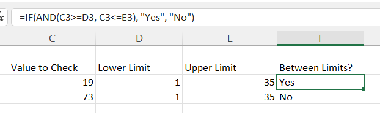
```

The formulas in cells F3 and F4 returns if the value in column C is between the lower and upper limits.

## Using MEDIAN

A less well known method would be to use the `MEDIAN` function. The definition of median when searching in Google is

> "denoting or relating to a value or quantity lying at the midpoint of a frequency distribution of observed values or quantities, such that there is an equal probability of falling above or below it"

When checking if a value is between another two values, using `MEDIAN` is also a good choice.

```{r, fig.cap="Using the MEDIAN function"}
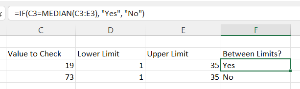
```

The formulas in cells F3 and F4 returns if the value in column C is the median value of the cells in columns C, D and E.

## Creating the LET

To create a custom `LAMBDA` function, let's first create the `LET` formula that will be used within the custom function.

```{r, fig.cap="Using the LET function"}
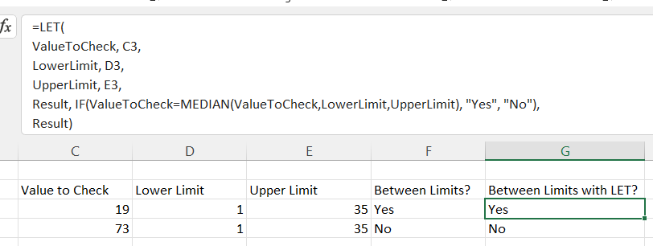
```

Here we have created the three variables, `ValueToCheck`, `LowerLimit` and `UpperLimit` that are fed into the `Result` variable where the actual calculation is performed.

## Creating the LAMBDA

Now the LET has been created, the custom function can now be created by moving the three parameters used by the `MEDIAN` function outside the `LET` so they can be entered by the user.

```{r, fig.cap="Using the LAMBDA function"}
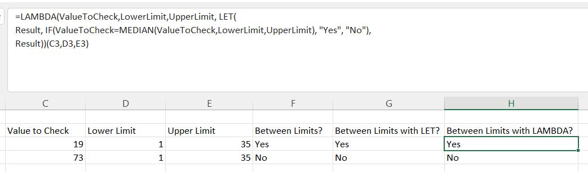
```

Using a LAMBDA custom function with this format with the input cells at the end of the function is not the method to use. Rather the formula is added to the Name Manager and a suitable name is assigned to it.

```{r, fig.cap="Using the Name Manager"}
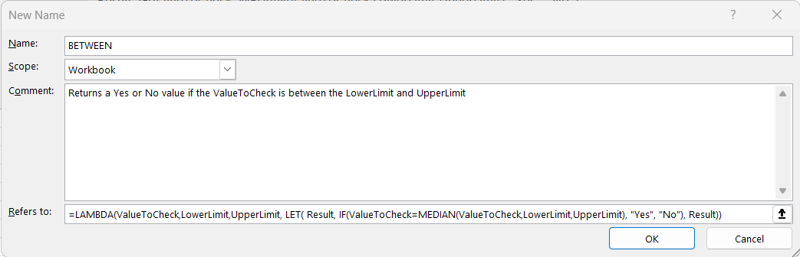
```

Now the formula is custom function, it can be called just by entering the name of the function in a cell and adding the relevant cells as parameters.

```{r, fig.cap="Using the BETWEEN custom function"}
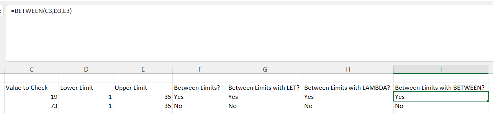
```

# Another Problem

Now we have the custom function, we can use this on multiple ranges and get a result back. However, there is an issue.

```{r, fig.cap="Using the BETWEEN custom function across multiple cell ranges"}
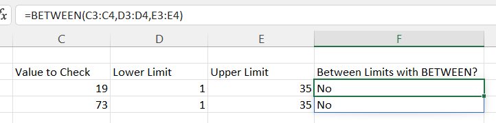
```

As shown above, the custom function now returns `No` for the values in row 3, where the value should be `Yes`.

# Another Solution

To ensure we get the correct results when include a range of cells more than one row, we can use the `BYROW` function to evaluate each row individually.

Using this function, we can amend the LAMBDA function to create an array of data using the `HSTACK` function and loop through each row within the array.

```{r, fig.cap="Using the BYROW function across multiple rows"}
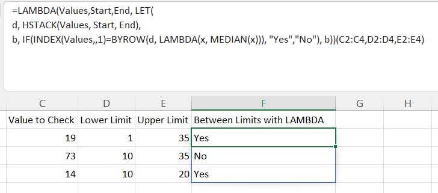
```

# A Shorter Solution

Now we have a `LAMBDA` that works across multiple rows, we can adapt it further to reduce the size of the custom function and refer to the complete range to check into one input parameter

```{r, fig.cap="The final LAMBDA function"}
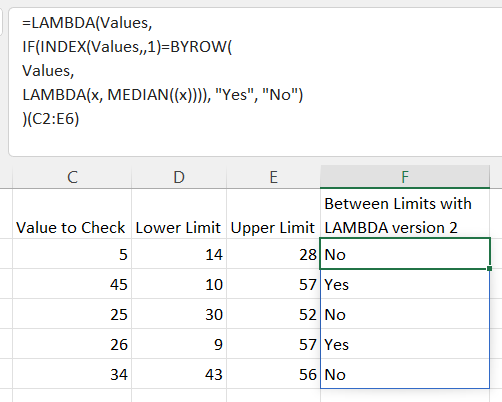
```

# The Final Function

The final function that will be named as our `BETWEEN` function will be shorter and work across multiple rows by using just one input variable.

> =LAMBDA(Values, 
  IF(
    INDEX(Values,,1)=BYROW(
      Values, 
      LAMBDA(x, MEDIAN((x)))
      ), 
      "Yes", 
      "No"
    ) 
  )


```{r, fig.cap="The BETWEEN function"}
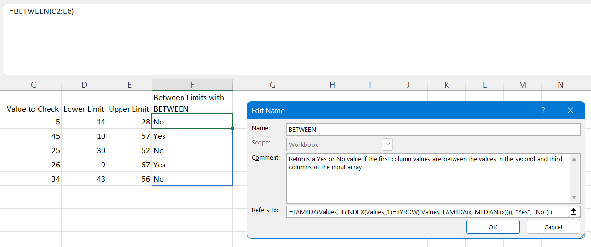
```

# Date values?

As Excel stores dates as numbers, the custom function will also work on date values


```{r, fig.cap="The BETWEEN function with date values"}
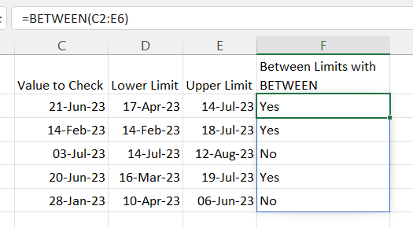
```

